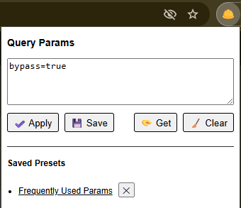
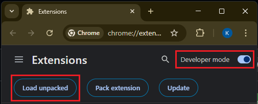

# The Extension

## How to Install

1. Download the latest release.
2. Unzip the archive to the location where you want to keep the extension files.
3. In your browser go to **Manage Extensions**.
4. Make sure **Developer Mode** is enabled.
5. Click on **Load unpacked** and select the folder that contains the extension files.  

## How to Update (to maintain presets)

1. Locate where you initially installed the extension.
2. Replace the old extension files with the new ones from the downloaded zip file.
